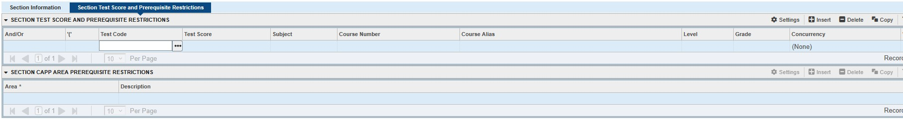
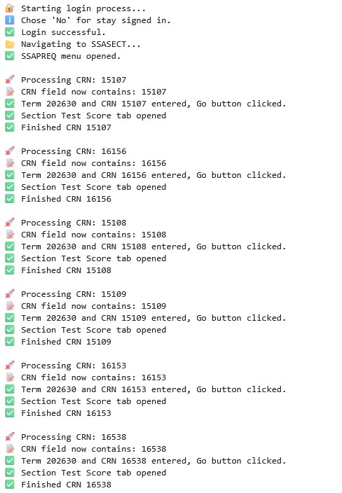
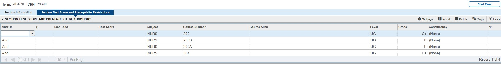

# Automated Updating of Course Prerequisites

## Process Automation for Banner Student Information System (SIS)

### Project Overview

Academic institutions frequently update course prerequisites to ensure students meet enrollment requirements and curriculum progression standards. Traditionally, these updates are performed manually within the Banner Student Information System (SIS), requiring staff to navigate multiple screens and update each course section individually.

To improve efficiency, I developed a Python and Selenium automation solution that automatically navigates Banner, updates prerequisite requirements, validates entries, and processes multiple course sections in batch mode.

The project was developed within a higher education Registrar environment and supports academic scheduling, curriculum management, and student enrollment operations.

---

## Project Highlights

- Automated prerequisite updates in Banner SIS
- Reduced repetitive administrative work
- Improved consistency and accuracy of prerequisite assignments
- Enabled batch processing of multiple CRNs
- Minimized manual navigation and data entry
- Increased operational efficiency within Registrar processes

---

# PACE Methodology

---

# PLAN

## Business Problem

Updating course prerequisites is a critical academic administration process that ensures students meet enrollment requirements before registering for advanced courses.

Historically, prerequisite updates were performed manually in Banner SIS, requiring staff to navigate through multiple screens and enter prerequisite information section by section.

This process often resulted in:

- Inefficient use of staff time
- Repetitive data entry
- Increased risk of human error
- Inconsistent prerequisite assignments
- Limited scalability during peak registration periods

These challenges impacted operational efficiency and increased administrative workload within the Registrar’s Office.

---

## Project Goal

Develop an automated solution capable of:

- Updating course prerequisites in Banner SIS
- Processing multiple CRNs automatically
- Standardizing prerequisite assignments
- Reducing manual effort
- Improving data accuracy
- Supporting Registrar operational efficiency

---

## Success Criteria

- Reduce manual processing time
- Improve consistency across updates
- Minimize data entry errors
- Increase throughput during registration cycles
- Create a reusable automation framework

---

# ANALYZE

## Existing Workflow Assessment

### Manual Process

Before automation, staff were required to:

1. Log into Banner SIS
2. Open SSAPREQ (Schedule Prerequisite and Test Score Restrictions)
3. Search for a specific CRN
4. Navigate to prerequisite records
5. Manually enter prerequisite requirements
6. Save changes
7. Repeat for every section

### Workflow Before Automation

```text
Login to Banner
        ↓
Open SSAPREQ
        ↓
Search CRN
        ↓
Enter Prerequisites
        ↓
Save Changes
        ↓
Repeat Process
```

---

## Bottlenecks Identified

| Bottleneck | Operational Impact |
|------------|-------------------|
| Manual navigation | Increased processing time |
| Repetitive data entry | Higher risk of errors |
| Multiple screen interactions | Reduced productivity |
| Large update batches | Limited scalability |
| Manual validation | Additional administrative effort |

---

## Risks of Manual Updates

### Operational Risks

- Incorrect prerequisite assignments
- Missing prerequisite requirements
- Data entry mistakes
- Inconsistent updates
- Delays during registration preparation

### Administrative Risks

- Increased workload
- Reduced operational efficiency
- Resource constraints during peak scheduling periods

---

## Time & Effort Analysis

### Estimated Manual Process

| Activity | Estimated Time |
|-----------|---------------|
| Open Section | 15–30 sec |
| Navigate SSAPREQ | 15–20 sec |
| Enter Prerequisites | 30–60 sec |
| Save & Validate | 15–20 sec |
| Total per Section | ~1–2 minutes |

For large batches of sections, the time investment grows significantly and creates opportunities for human error.

---

# CONSTRUCT

## Solution Architecture

The solution leverages Python and Selenium to automate Banner interactions and prerequisite updates.

```text
CRN List
    ↓
Python Automation
    ↓
Selenium WebDriver
    ↓
Banner Authentication
    ↓
SSAPREQ Navigation
    ↓
Prerequisite Updates
    ↓
Validation
    ↓
Save Changes
```

---

## Technologies Used

| Technology | Purpose |
|------------|---------|
| Python | Automation development |
| Selenium | Browser automation |
| Firefox WebDriver | Banner interaction |
| Banner SIS | Student Information System |
| Registrar Operations | Business process environment |

---

## Automation Workflow

### Step 1 — Banner Authentication

The automation performs the login process automatically using Selenium.

Functions include:

- Username entry
- Password entry
- Sign-in workflow
- Session management

---

### Step 2 — Navigation to SSAPREQ

The bot automatically locates and opens:

```text
Schedule Prerequisite and Test Score Restrictions (SSAPREQ)
```

This removes the need for repetitive manual navigation.

---

### Step 3 — Batch Processing

A predefined list of CRNs is loaded into the automation.

Example:

```python
crn_list = [
    "24332",
    "23342",
    "23343"
]
```

The automation processes each CRN sequentially.

---

### Step 4 — Automated Prerequisite Updates

The script automatically populates prerequisite requirements for each section.

Example prerequisite structure:

```text
NURS 200A
AND
NURS 200S
AND
NURS 220A
```

The automation:

- Navigates fields
- Clears existing values
- Inserts prerequisite information
- Applies logical operators
- Moves through rows automatically

---

### Step 5 — Validation & Save

After prerequisites are entered:

```text
F10 → Save
F5 → Refresh
```

The automation confirms the update and prepares the next section for processing.

---

## Technical Design

### Modular Architecture

The project separates responsibilities into reusable functions:

| Function | Purpose |
|-----------|---------|
| Login Process | Authentication |
| Navigation Logic | Access Banner forms |
| CRN Processing | Section retrieval |
| Prerequisite Updates | Data entry automation |
| Validation | Entry verification |
| Save Operations | Commit updates |

---

## Error Handling

To improve reliability, the automation includes:

### Explicit Waits

Ensures Banner pages are fully loaded before interaction.

### Exception Handling

```python
try:
    ...
except Exception:
    ...
```

Prevents unexpected interruptions.

### Screenshot Logging

Automatically captures screenshots when errors occur.

### Input Verification

Confirms correct CRN values before updates are applied.

---

# EXECUTE

## Implementation Results

### Before vs After

| Process Area | Before Automation | After Automation |
|--------------|------------------|------------------|
| Banner Navigation | Manual | Automated |
| Data Entry | Manual | Automated |
| Validation | Manual | Automated |
| Batch Processing | Limited | Scalable |
| Consistency | Variable | Standardized |
| Processing Speed | Slower | Faster |

---

## Operational Impact

### Benefits Achieved

✅ Reduced repetitive administrative work

✅ Improved prerequisite consistency

✅ Reduced risk of manual data entry errors

✅ Accelerated processing of large update batches

✅ Improved Registrar operational efficiency

✅ Increased process scalability

---

## Business Value

This project demonstrates how automation can improve operational workflows within higher education administration.

Instead of spending hours updating prerequisites manually, staff can focus on higher-value activities such as:

- Academic scheduling
- Curriculum management
- Student support
- Data analysis
- Process improvement initiatives

---

## Key Features

- Automated Banner navigation
- Batch CRN processing
- Automated prerequisite assignment
- Validation checks
- Error handling and recovery
- Screenshot-based debugging
- Reusable automation framework

---

## Skills Demonstrated

### Process Automation

- Workflow automation
- Task orchestration
- Operational optimization

### Python Development

- Modular scripting
- Function design
- Exception handling

### System Integration

- Selenium automation
- Enterprise system interaction
- Legacy application support

### Operational Analytics Mindset

- Process improvement
- Efficiency analysis
- Scalability planning

---

## Recommended Portfolio Visuals

### Banner Manual Process

```text
## Picture of Before ##
```



---

### Automation Execution

```text
## Picture of Automation Running ##
```



---

### Updated Prerequisites

```text
## Picture of After ##
```



---

### Solution Architecture

```text
## Workflow Diagram ##
```

Visual representation of:

CRN Input → Python → Selenium → Banner → Validation → Save

---

## Future Enhancements

- Excel-driven prerequisite templates
- Dynamic prerequisite mapping
- Audit logging database
- Email notification system
- Dashboard for execution monitoring
- User interface for non-technical users
- Automated reporting and metrics

---

## Conclusion

The **Automated Updating of Course Prerequisites** project transformed a repetitive Banner SIS process into a scalable automation solution using Python and Selenium.

By eliminating manual navigation and repetitive data entry, the solution improved operational efficiency, increased consistency, reduced errors, and demonstrated the value of process automation within higher education administration.

This project showcases practical skills in process automation, workflow optimization, system integration, and operational problem solving—skills directly applicable to Data Analyst, Business Analyst, Operations Analyst, and Process Improvement roles.
